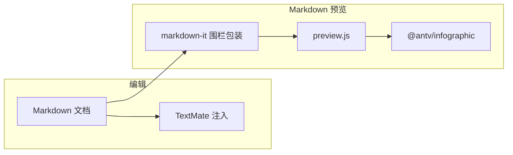

# AntV Infographic for VS Code 设计文档

本文档承接原 `README.md` 的设计与实现信息，聚焦技术方案、架构与工程细节。

## 目标与定位

在 Visual Studio Code 的 **Markdown** 工作流中集成 [AntV Infographic](https://github.com/antvis/infographic)：**声明式信息图语法**与 **SVG 渲染**，让文档里的信息图可写、可看、可维护。

实现上对齐 [VS Code Markdown 扩展指南](https://code.visualstudio.com/api/extension-guides/markdown-extension)（`markdown.markdownItPlugins`、`markdown.previewScripts`、TextMate 注入），并与 [vscode-mermaid-preview](https://github.com/Mermaid-Chart/vscode-mermaid-preview) 一类「Markdown 内嵌 + 预览增强」产品体验一致。

**要求**：VS Code `>= 1.85.0`（见 `package.json` 中 `engines.vscode`）。

## 功能概览

| 能力 | 说明 |
|------|------|
| **语法支持** | Markdown 中 ` ```infographic ` 围栏块通过语法注入高亮；另注册语言 id `infographic`（扩展名 `.infographic`）与 `language-configuration.json`（注释、括号配对等）。 |
| **渲染支持** | 在 **Markdown 预览** 中将 Infographic 源码渲染为信息图（`@antv/infographic`），源码在 DOM 中以隐藏 `template` 保留以便预览增量更新。 |

## 使用方式

在 Markdown 中使用围栏代码块，语言标识符为 **`infographic`**：

````markdown
```infographic
infographic list-row-simple-horizontal-arrow
data
  lists
    - label Step 1
      desc Start
    - label Step 2
      desc In Progress
```
````

打开 **Markdown 预览** 即可查看渲染结果。

更多语法见 [AntV Infographic README](https://github.com/antvis/infographic) 与站点 [infographic.antv.vision](https://infographic.antv.vision)。

示例文件：[examples/sample.md](examples/sample.md)。

## 本地开发

需已安装 [pnpm](https://pnpm.io/installation)（推荐通过 Corepack：`corepack enable` 后使用仓库内 `packageManager` 字段锁定的版本）。

```bash
pnpm install
pnpm run build      # 生成 dist/extension.js、dist/preview.js
pnpm run watch      # 监听重建，配合 F5 调试
```

在 VS Code 中打开本仓库，选择 **Run Extension**（会先执行默认构建任务 **pnpm: build**），在扩展开发宿主中打开 `examples/sample.md` 并打开预览。

### 打包扩展

```bash
pnpm run vsix
# 或：pnpm exec @vscode/vsce package --no-dependencies
```

使用 pnpm 时，`vsce` 默认的 `npm list --production` 校验会与 pnpm 的目录结构及上游包的 devDependencies 声明冲突。本仓库已将运行时打进 `dist/`，且 `.vscodeignore` 不包含 `node_modules`，因此打包脚本使用 **`--no-dependencies`** 跳过该校验（与官方对 pnpm/yarn 场景的说明一致）。

生成 `.vsix` 后可通过 **Extensions: Install from VSIX** 安装。`dist/preview.js` 内含 `@antv/infographic` 浏览器打包，体积较大，属预期现象。

### 手工验收建议

1. 在 `.md` 中编写 ` ```infographic ` 块，确认编辑器内高亮正常。
2. 打开 Markdown 预览，确认信息图渲染、改字后预览更新。
3. 故意写入错误语法，确认预览内出现简短错误提示而非整页崩溃。

## 架构（概要）



- **上游引擎**：[antvis/Infographic](https://github.com/antvis/infographic)（`@antv/infographic`）
- **参考扩展**：[vscode-mermaid-chart](https://github.com/Mermaid-Chart/vscode-mermaid-chart)

## 相关链接

- [AntV Infographic（GitHub）](https://github.com/antvis/infographic)
- [Mermaid VS Code 预览扩展](https://github.com/Mermaid-Chart/vscode-mermaid-chart)
